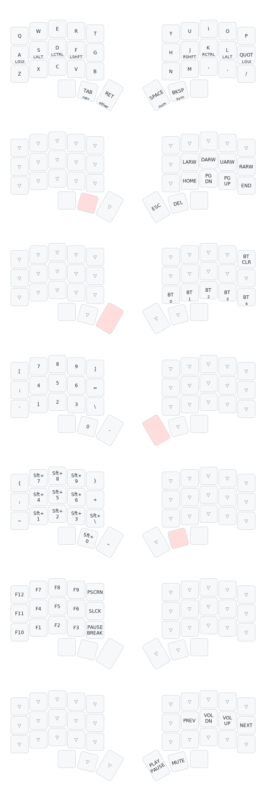

## Dactyl Cygnus
### A 36 keys handwired split keyboard.

### Build Details

Dactyl Cygnus is a handwired board originally designed by @juhakaup and available at [https://github.com/juhakaup/keyboards](https://github.com/juhakaup/keyboards).

### Dactyl Cygnus

Parts:
- 36 MX switches.
- 34 1u MX keycaps.
- 2 1.5u MX thumb keycaps.
- Cygnus [case](https://github.com/juhakaup/keyboards/tree/main/Cygnus%20v1.0/stl).
- [2 Supermini NRF52840](https://www.aliexpress.com/item/1005006035267231.html).
- [2 500mAh 3.7v battery - 752035](https://www.aliexpress.com/item/1005005984848543.html)
- [36 Single Switch PCBs](https://keycapsss.com/keyboard-parts/pcbs/173/mxledbit-single-switch-pcb-mx-choc-hot-swap-socket).
- [Dupont cables](https://aliexpress.com/item/1005004155181609.html).
- [1n4148 diodes + diode legs](https://pt.aliexpress.com/item/1005003540554760.html).
- [2 6x6x6 switch](https://www.aliexpress.com/item/4001166999847.html).

Parts for the dongle:
- Dongle [case](https://github.com/rafaelromao/keyboards/tree/main/stls/Dongle).
- [1 0.96 I2C OLED Screen](https://www.aliexpress.com/item/1005006262908701.html).
- [1 6x6x6 switch](https://www.aliexpress.com/item/4001166999847.html).
- [1 SS12F15 switch](https://www.aliexpress.com/item/4000699324084.html).
- [1 Supermini NRF52840](https://www.aliexpress.com/item/1005006035267231.html).
- [1 500mAh 3.7v battery - 752035](https://www.aliexpress.com/item/1005005984848543.html)

## Resources

- [ZMK Docs](https://zmk.dev/docs)
- [Keyboard Tester](https://config.qmk.fm/#/test)
