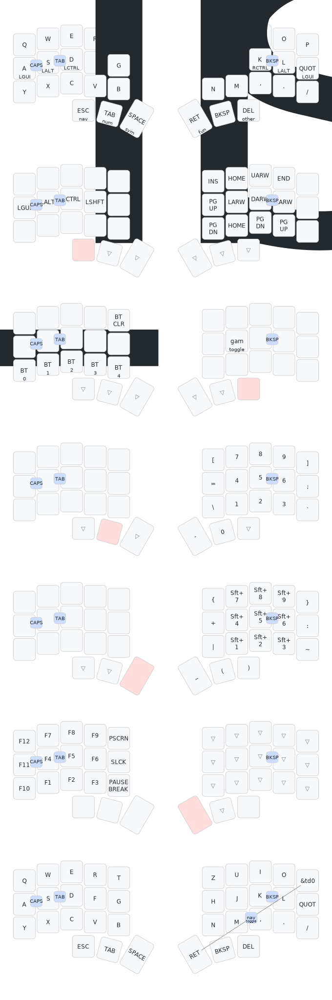

## Dactyl Cygnus

This is a fork 
### A 36 keys handwired split keyboard.

### Build Details

Dactyl Cygnus is a handwired board originally designed by @juhakaup and available at [https://github.com/juhakaup/keyboards](https://github.com/juhakaup/keyboards).

## Resources

- [ZMK Docs](https://zmk.dev/docs)
- [Keyboard Tester](https://config.qmk.fm/#/test)
